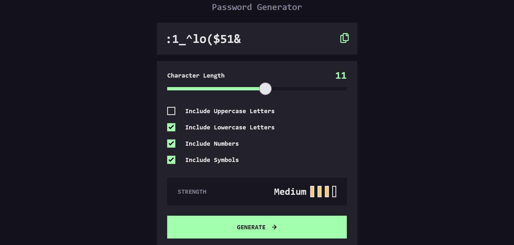

Password generator app solution

### The challenge
Users should be able to:

- Generate a password based on the selected inclusion options
- Copy the generated password to the computer's clipboard
- See a strength rating for their generated password
- View the optimal layout for the interface depending on their device's screen size
- See hover and focus states for all interactive elements on the page

### Links
- Solution URL: [https://github.com/Lapupeh/Password-generator-app.git]
- Live Site URL: [https://heartfelt-tiramisu-bcb227.netlify.app/]

### Built with

- Semantic HTML5 markup
- CSS custom properties
- Flexbox
- CSS Grid
- Mobile-first workflow
- Javascript

